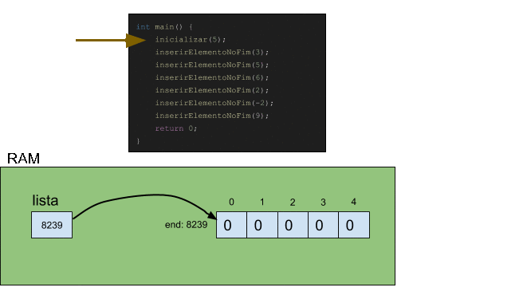
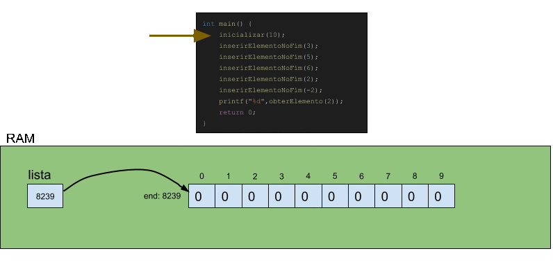
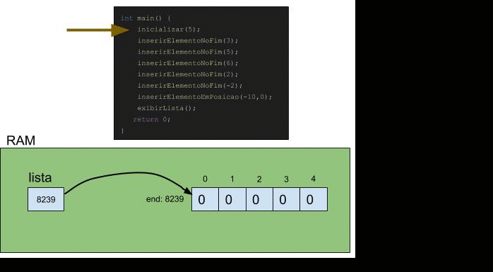
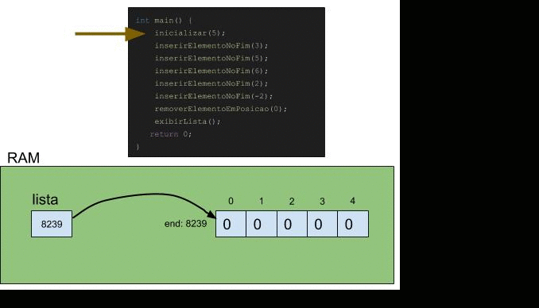

# ArrayLists

**Definição:**
> ArrayLists são listas implementadas com arrays (por "debaixo do panos").
 
Usar array como ED para implementar listas tem algumas consequências positivas e outras consequências negativas. Essas consequências decorrem do fato de algumas operações conseguirem ser executadas de forma extremamente rápida e outras operações serem executadas de forma lenta. 

Antes de investigar esses aspectos, vamos nos debruçar sobre as operações e suas implementações.

## Operações em ArrayLists

A princípio, vamos criar uma função para inicializar nosso array. A capacidade do array pode ser especificada no momento de sua criação. 

```c
int* lista; 

void inicializar(int capacidade){
    lista = calloc(capacidade, sizeof(int));
}
```

Uma discussão comum é a escolha dessa capacidade. Por um lado, se escolhermos um valor muito grande, podemos desperdiçar memória em boa parte do tempo. Por outro lado, embora valores menores desperdicem menos memória, em algum momento a lista ficará totalmente preenchida e um novo array, maior do que o anterior, deverá ser criado, causando mais processamento.

### Inserção no fim da lista

A peculiaridade da inserção é que arrays instanciados não mudam de tamanho naturalmente. Portanto, sempre que o array estiver totalmente preenchido, uma nova inserção irá requerer a criação de um novo array com maior capacidade, ou uma realocação que aumente a capacidade do array. Obviamente isto requer que os elementos previamente inseridos no array original sejam copiados para este novo array.

A seguir é apresentada uma animação que ilustra um ArrayList sendo inicializado e populado até além de sua capacidade, o que força a alocação de um novo array. Em seguida são apresentadas as implementações das funções *duplicarCapacidade* e *inserirElementoNoFim*.



```c
void duplicarCapacidade(){
    int novaLista[2*sizeof(lista)];
    for(int i = 0; i<sizeof(lista); i++){
        novaLista[i] = lista[i];
    }
    free(lista);
    lista = novaLista;
}

void inserirElementoNoFim(int valor){
    if(tamanho == sizeof(lista)){
        duplicarCapacidade();
    }
    lista[tamanho] = valor;
    tamanho++;
}
```

#### Outra forma de aumentar a capacidade

A linguagem C nos provê ferramentas para um gerenciamento rigoroso de memória RAM. A forma mais trivial de aumentar o tamanho de um array é alocando um novo array com maior capacidade e copiando os elementos do array antigo para o novo array, como mostrado acima. Agora vamos usar a função **realloc**, que é capaz de aumentar o tamanho do bloco de memória alocado, movendo-o para outra posição na memória quando for necessário.

```c
void duplicarCapacidade(){
    lista = (int*)realloc(lista, 2*sizeof(lista)*sizeof(int));
}
```
**Para refletir:**
O que vocês acham do desempenho dessa abordagem? Melhor? Pior? Me explique sua opinião. 

### Obtenção

Os arrays naturalmente nos provêem a opção de obter um elemento em uma posição específica usando o índice. O único cuidado que devemos ter é verificar se aquele índice é válido.

Note também que apesar da lista ter capacidade específica, ela pode ter uma quantidade de elementos menor do que esta capacidade. Na ilustração a seguir, a capacidade usada como exemplo é 10. Então, precisamos ter uma variável para controlar quantos elementos já foram inseridos na lista, de forma a usar este valor para saber se existe algum elemento em uma posição específica.

A seguir são apresentadas uma animação que ilustra um ArrayList sendo inicializado, além da obtenção do elemento no índice 2 do ArrayList, e a implementação da função *obterElemento*.



```c
int tamanho = 0;

int obterElemento(int posicao){
    if(posicao >= 0 && posicao < tamanho){
        return lista[posicao];
    }
}
```

### Inserção em local específico da lista

Para inserir um elemento em uma posição específica precisamos tomar o cuidado de deslocar todos os elementos uma posição à direita, para abrir espaço para o novo elemento. Nesta operação, também precisamos tomar o cuidado de verificar se há espaço no array para inserir este elemento, caso contrário, devemos utilizar a função que duplica a capacidade do array.

Lembre-se que na interface *inserirElemento(int valor, int posicao)*, posição refere-se ao índice da lista. Ou seja, para adicionar na primeira posição, *posicao = 0*. Note também que precisamos verificar se posição é um valor válido.

A seguir é apresentada uma animação que ilustra um ArrayList sendo preenchido, e no final acontece uma inserção na posição 0. Depois é apresentado o código-fonte da função *inserirElementoEmPosicao*.



```c
void inserirElementoEmPosicao(int valor, int posicao){
    if(posicao >= 0 && posicao <= tamanho){    
        if(tamanho == sizeof(lista)){
            duplicarCapacidade();
        }
        for(int i = tamanho; i > posicao; i--){
            lista[i] = lista[i-1];
        }
        lista[posicao] = valor;
        tamanho++;
    }
}
```

### Atualização em local específico da lista

Para atualizar o valor em uma posição específica da lista basta nos certificarmos de que aquela posição é válida.

```c
void atualizarElemento(int valor, int posicao){
    if(posicao >= 0 && posicao < tamanho){    
        lista[posicao] = valor;
    }
}
```

### Contagem

Da forma que implementamos a lista, a própria variável *tamanho* está sempre atualizada com o tamanho da lista. Desse modo, não precisamos iterar sobre a lista pra fazer a contagem.

```c
int getTamanho(){
    return tamanho;
}
```

### Remoção no fim da lista

Remover um elemento no fim da lista é muito simples. Se decrementarmos a variável tamanho, ainda que o valor esteja na lista, o modo como as funções são implementadas desconsidera a existência daquele valor.

```c
void removerElemento(){
    tamanho--;
}
```

### Remoção em local específico da lista

Para remover um elemento de uma posição específica da lista, precisamos deslocar uma posição à esquerda todos os elementos que estão à direita dessa posição. Com isto, o elemento que antes ocupava esta posição é virtualmente removido.

A seguir são apresentadas animação e implementação desta operação.



```c
void removerElementoEmPosicao(int posicao){
    if(posicao >= 0 && posicao < tamanho){    
        while(posicao < tamanho-1){
            lista[posicao] = lista[posicao+1];
            posicao++;
        }
        tamanho--;
    }
}
```

## Noções de Desempenho

É muito importante estudar os algoritmos e EDs sob a perspectiva de seus desempenhos. Embora neste ponto do curso nós ainda não aprendemos sobre **análise assintótica de algoritmos**, que é o assunto que trata dos formalismos matemáticos para analisar o desempenho de algoritmos, nós podemos fomentar uma discussão que nos permita ter noções de por quê as *funções de inserção, remoção, obtenção e atualização* desempenham bem ou mal.

### Arrays são alocados em blocos contíguos de RAM!

Antes de analisar as funções é preciso destacar a principal propriedade de um array: em sua criação, blocos contíguos de RAM são alocados para ele. A grande vantagem disto é que se tivermos um array de int com 10^6 posições, então é possível acessar o último elemento do array, i.e., o elemento da posição (10^6)-1, de forma instantânea, sem precisar escanear todo o array.

Note que em nossas animações dos algoritmos eu escolhi aleatoriamente que o array estava sempre sendo instanciado no endereço 8239. Como o array é de inteiros, e sabemos que cada int ocupa 4 bytes, então sabemos que podemos obter o elemento da posição (10^6)-1 da seguinte forma: **8239 + posição * 4, que neste caso seria 8239 + (10^6-1) * 4**. Obviamente esta lógica funciona para arrays de quaisquer tamanhos.

### Análise de desempenho das funções

Aqui vamos classisficar o desempenho em **instantâneo** sempre que não precisarmos percorrer o array para executar uma função, e **proporcional ao tamanho do array** sempre que a função necessitar escanear todo o array (pelo menos na situação mais extrema, que chamamos de pior caso).

- **inserirElementoNoFim:** depende da necessidade ou não de duplicação do array; quando não for necessário duplicar o array, o desempenho será **instantâneo**
- **duplicarCapacidade (novo array):** desempenho será **proporcional ao tamanho do array** dado que sera preciso iterar no array antigo para copiar os elementos para o novo array
- **duplicarCapacidade (realloc):** será **instantâneo** se a realocação de memória não impuser mudança para um novo endereço, mas também pode ser **proporcional ao tamanho do array** se for preciso copiar o conteúdo do array anterior para um novo endereço
- **obterElemento:** **instantâneo** pois como o bloco de memória alocado para o array é contíguo, é possível calcular o exato endereço de memória do elemento que está sendo buscado
- **inserirElementoEmPosicao:** pode ser **proporcional ao tamanho do array** se o elemento for inserido na posição 0, o que causa um deslocamento de todos os elementos do array
- **atualizarElemento:** **instantâneo** pelas mesmas razões de **obterElemento** (é possível calcular o exato endereço de memória do elemento que se deseja atualizar)
- **getTamanho:** **instantâneo**
- **removerElemento:** **instantâneo**
- **removerElementoEmPosicao:** **proporcional ao tamanho do array** pelas mesmas razões de **inserirElementoEmPosicao** (uma remoção do elemento na posição 0 causa um deslocamento de todos os elementos do array)