# Árvores

Até agora, aprendemos a utilizar uma série de estruturas de dados lineares: 

- ArrayList:
    - 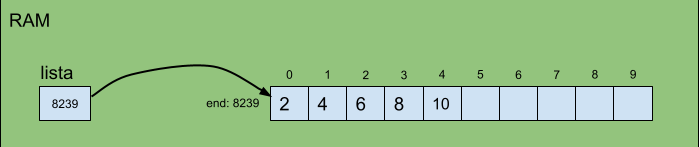
- LinkedList:
    - 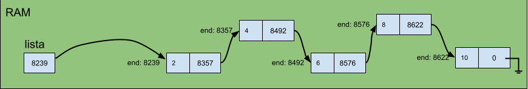
- DoublyLinkedList:
    - 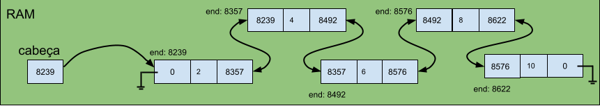
- ArrayStack:
    - 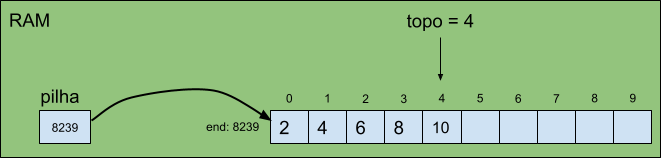
- LinkedListStack:
    - 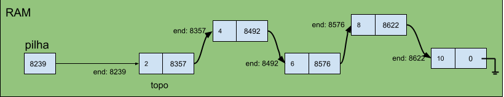
- ArrayQueue:
    - 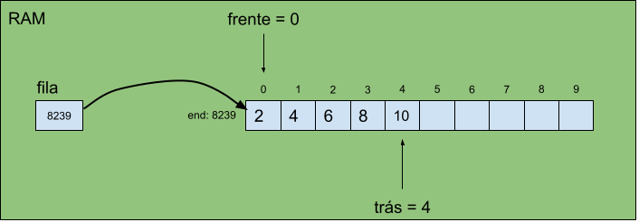
- LinkedListQueue:
    - 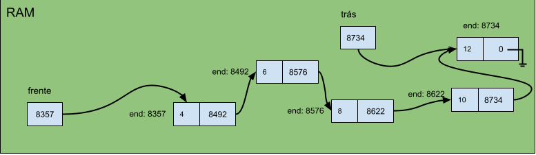

Todas essas estruturas de dados são formas de armazenar e organizar dados em computadores.
Para diferentes situações, com diferentes tipos de dados, diferentes estruturas de dados serão apropriadas.
A escolha da ED depende de uma série de fatores:
- Tipo de dado será armazenado
- Operações executadas com mais frequência, e complexidade de tempo associados
    - Exemplo: uma coleção com dados numéricos, e a principal operação seria perguntar se um determinado valor está na coleção (qual estrutura vocês utilizariam?)
- Complexidade de espaço (uso de memória)

Árvore é uma ED hierárquica, ou seja, ela é usada para armazenar dados que possuem relacionamentos hierárquicos bem definidos.
Um exemplo de aplicação é o armazenamento de dados de funcionários preservando a hierarquia entre eles. 

 | 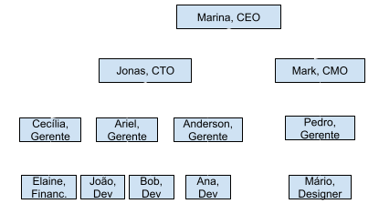 |
:-------------------------:|:-------------------------:|

No entando, a forma como organizamos os dados em uma árvore nos remete a uma representação invertida.
Note que Marina está na base da árvore, representando, portanto, a raiz da árvore.
A representação da ED árvore é sempre assim: raiz no topo, e ramificações da árvore crescendo para baixo.

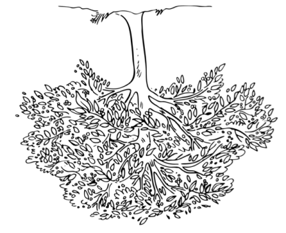 

## Definição de Árvore e Vocabulário

A ED árvore é uma coleção de entidades chamadas de **nós**, que são ligados para representar a hierarquia.
O nó mais superior da árvore é a **raiz**.
Cada nó pode armazenar valores de quaisquer tipo.
No exemplo anterior, armazenamos um par de strings, uma string para o nome, e outra string para o cargo.
Além disso, cada nó pode conter links para outros nós, que são chamados de **filhos**.
Cada seta do gráfico representa o link entre nós.

A seguir é ilustrada uma árvore genérica, sem valores, e cujos nós são identificados por valores inteiros atribuídos de acordo com nenhuma propriedade ou ordem específica (apenas para fins de identificação mesmo).

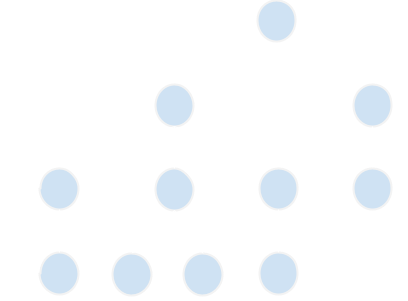 

- raiz(): nó 1
- filhos(1): nós 2 e 3
- pai(2): nó 1
- pai(3): nó 1
- filhos(2): nós 4, 5 e 6
- pai(4): nó 2
- pai(5): nó 2
- pai(6): nó 2
- filhos(3): nó 7
- pai(7): nó 3
- irmãos(1): null
- irmãos(2): nó 3
- irmãos(4): nós 5 e 6
- irmãos(9): nó 10
- irmãos(8): null
- folhas(): nós 8, 9, 10, 11 e 7
- avô(8): nó 2
- netos(2): nó 8, 9, 10, e 11
- avô(4): nó 1
- netos(1): nós 4, 5, 6, e 7
- avô(2): null
- ancestrais(9): nós 5, 2, e 1
- descendentes(2): nós 4, 5, 6, 8, 9, 10, e 11
- ancestrais comuns de  8 e 9: nós 2 e 1 
- os nós 6 e 7 são irmãos? não, eles são primos
- primos(11): nós 8, 9 e 10
- tios(10): nós 4 e 6

### Propriedades

Árvores são consideradas EDs **recursivas**.
Cada árvore contém uma raiz e aponta para outras ávores, que são consideradas suas sub-árvores.
Para fins de prática, tente identificar árvores e sub-árvores na ilustração anterior.

Um ávore com n nós terá **n-1 links (ou arestas)**.
Cada nó, exceto a raiz, precisa ter uma aresta apontando pra ele, pois não podemos ter nós desconectados da árvore.

**Profundidade** de um nó x é o comprimento do caminho da raiz até o nó x.
Em outras palavras, é o número de arestas da raiz até o nó x.

**Altura** de um nó x é o maior comprimento do caminho do nó x até a folha mais distante.
Portanto, a altura de qualquer nó folha é 0.
E consequentemente, a altura de uma árvore é a áltura do nó raiz.

De acordo com suas propriedades, as árvores podem ser classificadas em várias categorias.
A categoria mais simples e usada é a árvore binária, i.e., árvore no qual cada nó pode ter no máximo 2 filhos.

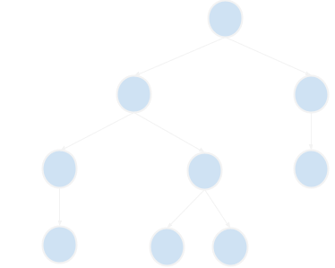 

A maneira mais comum de criar uma árvore é alocando os nós dinamicamente usando ponteiros.
Algo muito semelhante ao que fazemos com listas ligadas.

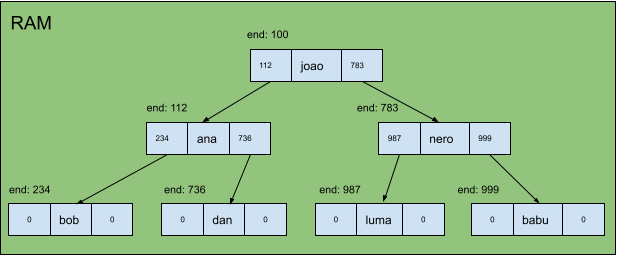

Programaticamente, os nós podem ser definido da seguinte forma (o tipo da variável dado pode ser escolhido de acordo com a situação):
```c
struct no{
    char* dado;
    struct no* esq;
    struct no* dir;
};
```

Aplicações:
- armazenamento de dados naturalmente hierárquicos: sistema de arquivos
- organizar dados para busca, inserção e remoção eficientes; O(lg(n))
- trie: dicionário; verificação ortográfica dinâmica
- algoritmos de roteamento de pacotes em uma rede

# Árvores de Busca Binária (BST)

E se nós quiséssemos armazenar uma coleção de inteiros para fazer operações de busca, inserção e remoção?
Vamos analisar estruturas já existentes:

Operações | ArrayList Desordenado | LinkedList | ArrayList Ordenado | BST
:-------------------------:|:-------------------------:|:-------------------------:|:-------------------------:|:-------------------------:|
busca(e) | | | |
insercao(e) | | | |
remocao(e) | | | |

Agora vejamos o gabarito:

Operações | ArrayList Desordenado | LinkedList | ArrayList Ordenado | BST
:-------------------------:|:-------------------------:|:-------------------------:|:-------------------------:|:-------------------------:|
busca(e) | O(n) | O(n) | O(log₂(n)) | O(log₂(n))
insercao(e) | O(n) | O(n) | O(n) | O(log₂(n))
remocao(e) | O(n) | O(n) | O(n) | O(log₂(n))

## Definição de Árvore de Busca Binária

Uma árvore de busca binária (BST, do inglês Binary-Search Tree) é uma árvore binária na qual para cada nó o valor de todos os nós à esquerda são menores ou igual e o valor de todos os nós à direita são maiores.

Ilustração de uma BST:

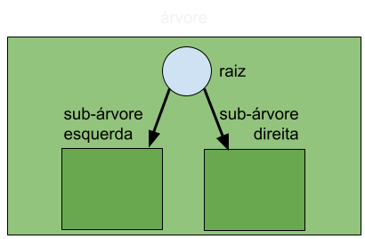

Ilustração de uma BST, ressaltando sua natureza recursiva:

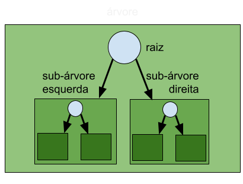

Ilustração de uma BST de inteiros:

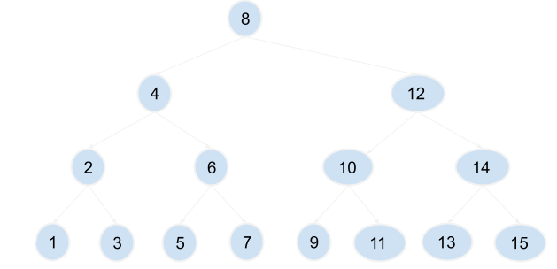

Ilustração do porquê de uma BST ser O(log₂(n)):

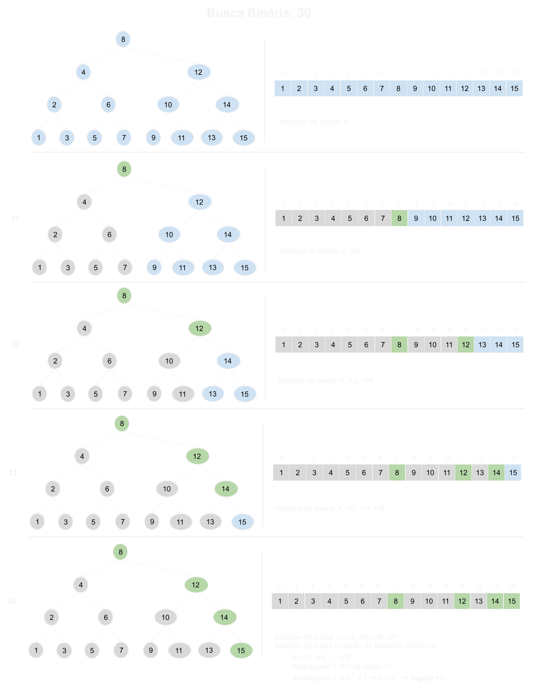

Porém, note que a complexidade de tempo das operações de busca, inserção e remoção em uma BST só é O(log₂(n)) se a árvore for balanceada.
Se a BST for completamente desbalanceada, na verdade o que teríamos seria algo semelhante à uma LinkedList, cujas operações possuem complexidade de tempo O(n).

Ilustração de BST completamente desbalanceada à direita.

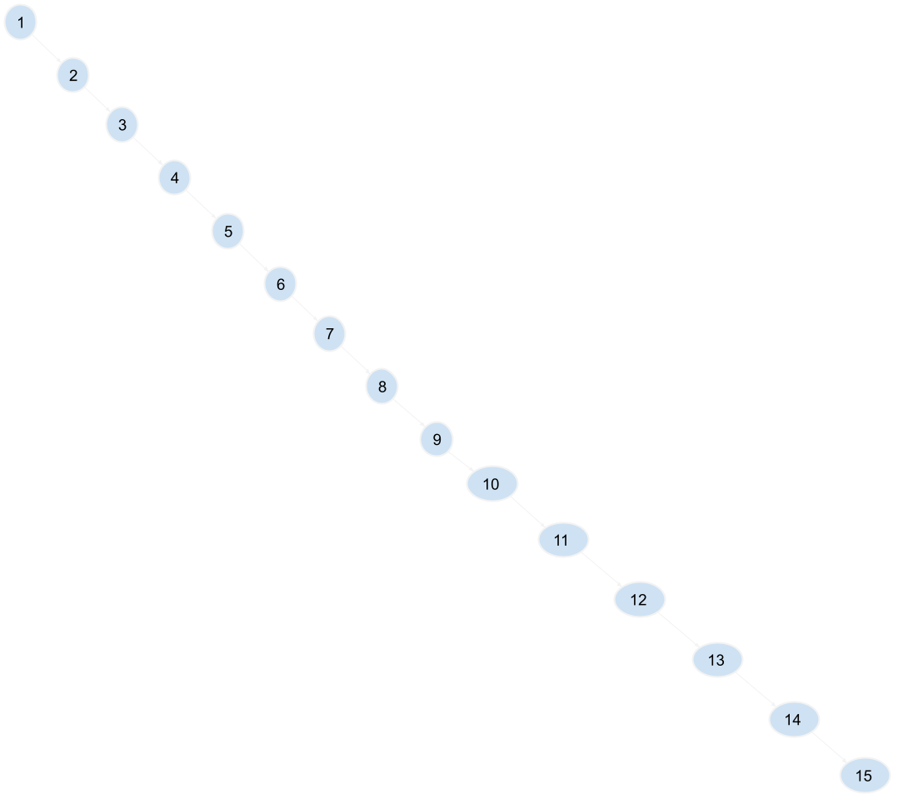

Ilustração de BST completamente desbalanceada à esquerda.

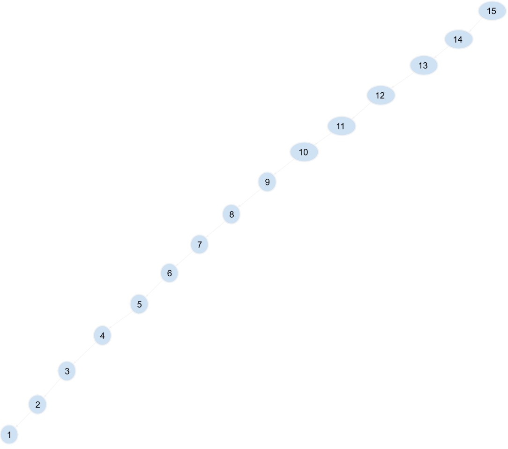

A maneira mais comum de criar uma árvore é alocando os nós dinamicamente usando ponteiros.
Algo muito semelhante ao que fazemos com listas ligadas.

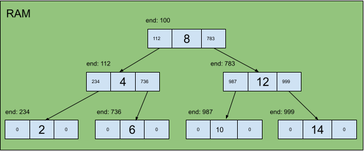

Programaticamente, os nós podem ser definido da seguinte forma:
```c
struct noBst{
    int val;
    struct noBst* esq;
    struct noBst* dir;
};
```

Nós são criados na heap via malloc.
Quando se trata de árvores, basta que guardemos o endereço do nó raiz, pois a partir dele conseguimos navegar em toda a árvore.

Segue assinaturas de funções a serem implementadas:

```c
struct noBst* alocarNovoNo(int val);

//pode ser implementado com recursão
void inserir(struct noBst** raiz, int val, int* tamanho)

//pode ser implementado com recursão
bool buscar(struct noBst* raiz, int val)
```

## Recursão e Alocação de Memória

Essas funções podem ser implementadas de forma recursiva, mas é interessante que analisemos como os dados ficam dispostos na memória.