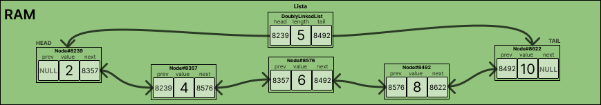

# DoublyLinkedLists

Antes de falarmos das DoublyLinkedLists em sí é importante ressaltar o adendo feito na explicação das LinkedLists quanto ao funcionamento dos blocos de memória e o esforço exercído pelo gerenciador de memória para minimizar a fragentação. Quando falamos das ArrayLists, vimos que elas são implementadas utilizando-se de arrays. Alocamos uma quantidade específica de espaço para este array, e tentamos expandi-lo a medida que seja necessário. Ao longo disso nós percebemos a principal problemática com essa ED: **arrays são sempre armazenados em blocos contíguos de memória**. 

De forma de contornar isso, foi demonstrada uma outra ED que possui métodos idênticos de manipuação mas que funciona de uma forma totalmente diferente dos ArrayLists por debaixo dos panos. Como vimos, as LinkedLists demonstram um maior potencial com relação a forma de manipulação e uma série de vantagens em comparação aos ArrayLists como por exemplo: definição de espaço dinâmico sem a possibilidade de memória ociosa no sistema, inserção/exclusão no inicio da lista sendo uma instrução barata e de fácil implementação, a possibilidade de utilização da memória mesmo quando fragmentada, dentre outras. 

Porém, ainda existem alguns pontos extremamente importantes que nós podemos melhorar nessa ED. E é ai que entram as **DoublyLinkedLists** (ou 'listas duplamente ligadas', em portugês). 

**Definição**

> Estrutura de dados linear, na qual os elementos não são armazenados em locais de memória contíguos. Os elementos em uma lista duplamente ligada são vinculados usando nós onde cada nó contém um campo de dados e dois ponteiros: um para o próximo nó na lista e outro para o anterior.

Segue abaixo um modelo de representação do funcionamento de uma DoublyLinkedList.



Cada ED traz consigo vantagens e desvantagens na operação de um TAD. E com as DoublyLinkedLists não é diferente. Além de termos as vantagens de uma LinkedList ganhamos alguns outros pontos extremamente importantes com relação a desempenho.

## Considerações de Desempenho de Espaço (RAM)

Um ponto positivo é que, assim com as LinkedLists, as DoublyLinkedLists nunca terão espaço ocioso, ao contrário de ArrayLists. No entanto, para cada elemento armazenado em uma lista duplamente ligada, dois espaços adicionais (2 x 4 bytes) é alocado para armazenar o ponteiro do próximo nó e do anterior.

## Estrutura

Listas duplamente ligadas são compostas por nós. Cada nó tem um valor e dois ponteiros apontando para o nó anterior e próximo. 
A primeira coisa que precisamos fazer é criar a estrutura que representa o nó.

```c
struct DoublyLinkedList {
	head   *Node # inicio da lista
	length int   # quantidade de elementos presentes na lista
    tail   *Node # ultimo elemento da lista
}

struct Node {
    prev  *Node # Nó anterior
	value int   # Valor presente no nó
	next  *Node # Próximo nó
}
```

## Operações em DoublyLinkedLists

Como as operações com LinkedLists e DoublyLinkedLists são extremamente semelhantes devendo apenas nos preocuparmos com o ajuste de ponteiros extras, abaixo deixarei detalhado apenas alguns metodos principais como iterar para imprimir a lista e a manipulação das informações utilizando os ponteiros da cabeça e cauda para adicionar elementos no inicio e fim da lista. Os demais metodos estão apenas com suas respectivas sugestões de assinatura para facilitar o processo de desenvolvimento.
    
### Imprimir Lista

Para imprimir a lista, podemos seguir o mesmo princípio utilizado nas LinkedLists já que possuimos a cabeça (head, no inglês), que é o primeiro elemento da lista, e o ponteiro para o próximo (next) elemento presente em cada nó (Node). Com isso, é o suficiente para percorrermos do inicio até o final da lista ou seja, até que o ponteiro para o próximo nó seja `NULL`, imprimindo seus valores como desejamos. 

Segue abaixo um código em `C` demonstrando essa implementação.

```c
void imprimirLista(struct no** head) {
    // usamos o aux para percorrer a lista
    if ((*head) != NULL) {
        struct no* aux = (*head);
        // navega partindo da cabeça até chegar NULL
        printf("[");
        do {
            printf("%d", aux->val);
            aux = aux->prox;
            if (aux != NULL) {
                printf(", ");
            }
        } while (aux != NULL);
        printf("]");
    }
    else {
        printf("A lista está vazia!");
    }
}
```

### Inserir Elemento no Fim da Lista

Temos dois casos principais:

1. **A lista está vazia.** Nesse caso, basta apontar a cabeça (head) e a cauda (tail) da lista para o nó recém-criado.
2. **A lista não está vazia.** Aqui temos uma vantagem com relação à implementação com linkedList. Não precisamos mais percorrer a lista para pegar o ultimo elemento, para somente então adicionar após ele. Nós temos a cauda da lista (tail) que aponta diretamente para o ultimo nó presente. Dessa forma, fica simples adicionar:
    - Criamos um novo nó;
    - Apontamos o anterior (prev) desse nó para a cauda atual da lista;
    - Apontamos o próximo (next) da cauda para esse novo nó;
    - Apontamos a cauda da lista para esse novo nó.

Sempre iremos incrementar a variável tamanho (length), independente do caso.

Segue assinatura da função para implementação:
```c
void inserirElementoNoFim(struct linkedlist* lista, int valor)
```

### Inserir Elemento no Início da Lista

Mais uma vez, temos dois casos principais:

1. **A lista está vazia.** Nesse caso, basta apontar a cabeça (head) e a cauda (tail) da lista para o nó recém-criado.
2. **A lista não está vazia.** Nesse caso, seguimos a mesma implementação da linkedList porém com um cuidado a mais devido ao ponteiro do elemento anterior do nó que era a cabeça da lista antes de adicionarmos. Ou seja, os passos se resumem a basicamente:
    - Apontamos o ponteiro `next` do nó recém-criado para o endereço que a cabeça da lista aponta atualmente;
    - Apontamos o ponteiro `prev` do nó recém-criado para null já que agora ele é a nova cabeça;
    - Apontamos a cabeça da lista para o nó recém-criado;
    - Apontamos o ponteiro `prev` do nó que estava na cabeça da lista para o novo nó.

Sempre iremos incrementar a variável tamanho (length), independente do caso.

Segue assinatura da função para ser implementada:
```c
void inserirElementoNoInicio(struct linkedlist* lista, int valor)
```

### Inserir Elemento em Posição Específica da Lista

Segue assinatura da função para ser implementada:
```c
void inserirElementoEmPosicao(struct linkedlist* lista, int valor, int posicao)
```

### Obter Elemento em Posição Específica da Lista

Segue assinatura da função para ser implementada:
```c
int obterElementoEmPosicao(struct linkedlist* lista, int posicao)
```

### Remover Elemento em Posição Específica da Lista

Segue assinatura da função para ser implementada:
```c
void removerElementoEmPosicao(struct linkedlist* lista, int posicao)
```

## Noções de Desempenho

| Operação                                           | ArrayLists                                                                       | LinkedLists                                                    | DoublyLinkedList                                                 |
|----------------------------------------------------|----------------------------------------------------------------------------------|----------------------------------------------------------------|------------------------------------------------------------------|
| Inserir elemento no fim (ainda há espaço no array) | **O(1)** *_performance não tem relação com o tamanho da lista_                   | **O(n)** *_performance **tem relação** com o tamanho da lista_ | performance **não tem relação** com o tamanho da lista: **O(1)** |
| Inserir elemento no fim (não há espaço no array)   | **O(n)** *_quando a realocação não pode ser feita reaproveitando o mesmo espaço_ | **O(n)** *_performance **tem relação** com o tamanho da lista_ | performance **não tem relação** com o tamanho da lista: **O(1)** |
| Inserir elemento no início                         | **O(n)** *_quando se insere na primeira posição de uma lista não vazia_          | **O(1)**                                                       | **O(1)**                                                         |
| Inserir elemento em posição                        | **O(n)** *_inserção no início_                                                   | **O(1)** *_inserção no fim_                                    | **O(1)**                                                         |
| Obter elemento em posição                          | **O(1)** *_conseguimos calcular o endereço de memória_                           | **O(n)**                                                       | **O(n)**                                                         |
| Atualizar elemento em posição                      | **O(1)** *_conseguimos calcular o endereço de memória_                           | **O(n)**                                                       | **O(n)**                                                         |
| Obter tamanho da lista                             | **O(1)**                                                                         | **O(1)**                                                       | **O(1)**                                                         |
| Remover elemento no fim                            | **O(1)**                                                                         | **O(n)**                                                       | **O(1)**                                                         |
| Remover elemento no início                         | **O(n)**                                                                         | **O(1)**                                                       | **O(1)**                                                         |
| Remover elemento em posição                        | **O(n)**                                                                         | **O(n)**                                                       | **O(n)**                                                         |