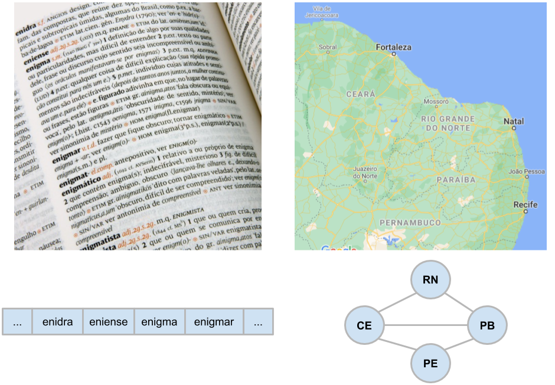

# Introdução a Estruturas de Dados

"Estrutura de dados (ED)"  é um conceito básico e fundamental quando se trata de programação. É importantíssimo que programadores tenham bom conhecimento das principais EDs, sabendo aplicá-las em situações adequadas, implementá-las, e refletir sobre pontos positivos e negativos de cada ED. Uma prova disto é que as grandes empresas de TI, como Google, Facebook e Apple, incluem nas etapas técnicas de seus processos de recrutamento perguntas/problemas que permitem o candidato mostrar seu conhecimento sobre as principais EDs e algoritmos.

Nós lidamos com dados o tempo inteiro, tanto em programas de computador como no nosso cotidiano. A forma como esses dados são dispostos pode ajudar ou atrapalhar as tarefas feitas com eles. Seguem alguns exemplos:

1. Palavras em um dicionário
    - Se as palavras não fossem armazenadas em uma lista que mantém **ordem lexicográfica**, é fato que passaríamos dias procurando por uma palavra em uma lista que contém milhões de palavras.
    - Outros exemplos semelhantes: **lista** de amigos em redes sociais, **lista** de médicos em um catálogo, **lista** de contatos em uma agenda, **lista** de livros em uma biblioteca.
2. Informações geográficas
    - Imagine que usamos uma lista ordenada lexicograficamente para armazenar ruas, bairros, cidades, estados e países. Para algumas situações essa lista poderia ajudar, mas para uma pessoa que precisa se localizar e saber as ruas/bairros/cidades vizinhas, essa lista não seria útil. Neste caso, o que o viajante precisa é de um **mapa**, um papel com geometrias que representam ruas/bairros/cidades. 
    - Geralmente, **grafo** é a ED usada para representar os locais, como cidades, e seus relacionamentos com cidades vizinhas (mas essa ED é abordada na disciplina subsequente).

Como visto, diferentes tipos de EDs são mais apropriadas para organizar diferentes tipos de dados. Em geral, computadores sabem lidar com quaisquer tipos de dados: textos, imagens, videos, dados relacionais, e qualquer outro tipo de dado que você imaginar. **A forma como organizamos e agrupamos dados nos nosso computador é fundamental, pois pode fazer com que o tempo de processamento de um dado dure milissegundos ou horas, dias e até mesmo meses.**

**Definição de Estruturas de Dados**, retirada do livro Introduction to Algorithms 3rd edition, de Cormen et. al (2009)
> "*A data structure is a way to store
and organize data in order to facilitate access and modifications.*"

Cormen et. al (2009) ainda complementam a definição com a seguinte informação:
> "*No single data structure works well for all purposes, and so it is important to know the strengths and limitations of several of them.*"

EDs são estudadas sob duas perspectivas:
1. Tipos Abstratos de Dados (TADs):
    - Usamos o conceito de abstração para nos referir a uma ED em alto nível, discutindo suas operações, mas não detalhando suas implementações.
    - Por exemplo, em **Listas** nós podemos:
        - adicionar elemento no fim;
        - adicionar elemento em uma posição específica;
        - remover elemento em uma posição específica;         
        - atualizar elemento em uma posição específica.
2. Implementações:
    - Quando discutimos uma implementação, tratamos dos detalhes técnicos de baixo nível, o que inclui os diferentes tipos de EDs e algoritmos usados para manipular as EDs. 
    - Por exemplo, para o TAD **Listas** a discussão inclui:
        - Qual ED será utilizada: arrays, listas ligadas, listas duplamente ligadas;
        - Os algoritmos utilizados para implementar as operações discutidas no TAD Listas vão naturalmente variar com as EDs escolhidas.
        - O desempenho das operações também vão variar de acordo com as EDs escolhidas.
        
    **Menos importante:** linguagem de programação utilizada. O desempenho das operações permanecem os mesmos independentemente das linguagens de programação utilizadas, mas linguagens de níveis mais baixo, como C e C++, permitem gerenciar os recursos de forma mais rigorosa.

**Definição de Tipos Abstratos de Dados (TADs):**
> TADs definem dados e operações, mas não definem detalhes de implementação.

**TADs que estudaremos nessa disciplina: listas, filas, pilhas, árvores, tabelas hash, e heaps.**

Em resumo, para cada combinação de TAD e ED, estudaremos suas operações, noções de custo, e implementação na linguagem C.