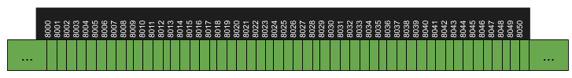
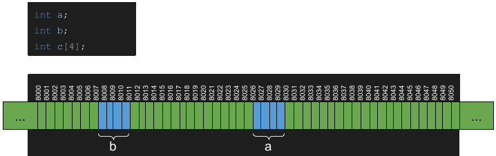
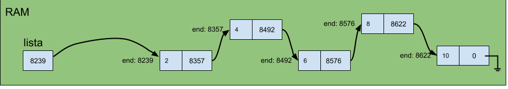
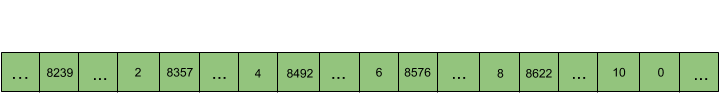
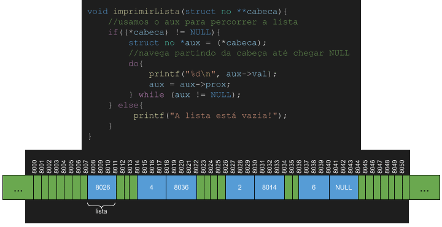
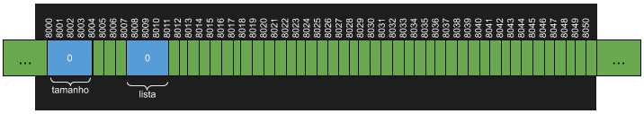

# LinkedLists

Antes de iniciarmos, vamos motivar LinkedLists provendo uma visão geral do funcionamento do Gerenciamento de Memória.

A seguir representamos a memória RAM através de uma visão lógica. Note como dividimos a memória em uma sequência de bytes. 



Imagine que vamos escrever uma simples aplicação na linguagem C para alocar duas variáveis inteiras e um array para armazenar quatro inteiros. Como um int precisa de 4 bytes para ser armazenado, neste caso precisaríamos de 32 bytes, 8 para os inteiros, e 16 para o array. Os inteiros podem ser armazenados em qualquer posição da memória, mas os **arrays são sempre armazenados em blocos contíguos de memória**, e isto traz algumas implicações.

Observe a animação a seguir:


Faz sentido que o Gerenciador de Memória busque minimizar a fragmentação, i.e., diminuir a quantidade de espaços de memória pequenos desalocados (ou de forma coloquial, diminuir a quantidade de "buracos"). Neste caso, o Gerenciador de Memória primeiro tentaria alocar o array *c* entre *b* e *a*, mas isto não seria possível pois *c* precisa de 16 bits, mas há apenas 15 bits disponíveis entre *a* e *b*.

Quando falamos de ArrayLists, sabemos que as listas são implementadas com arrays. Nesse caso, geralmente aloca-se uma quantidade específica de espaço para este array, e tenta-se expandir a medida que seja necessário. Um problema de ArrayLists é que ocasionalmente eles podem ter memória ociosa. Para evitar este desperdício de memória podemos usar um outro tipo de ED: a **LinkedList**.

**Definição:**
> LinkedLists (ou listas ligadas, em português) são listas implementadas com nós, e cada nó possui um espaço de memória para armazenar o elemento e outro espaço de memória para armazenar o ponteiro (endereço de memória) para o nó seguinte.

Segue ilustração de uma LinkedList contendo valores numéricos pares.



Uma outra forma de ilustrar, que considero até mais fidedigno, é representando os valores dispostos de maneira lineares, como de fato acontece na memória RAM.



Cada ED traz consigo vantagens e desvantagens na operação de um TAD. E com as LinkedLists não é diferente. 

## Considerações de Desempenho de Espaço (RAM)

Um ponto positivo é que listas ligadas nunca terão espaço ocioso, ao contrário de ArrayLists. No entanto, para cada elemento armazenado em uma lista ligada, um espaço adicional (4 bytes) é alocado para armazenar o ponteiro do próximo nó. Então, se tivermos um TAD lista que na maioria do tempo permanece (quase) totalmente preenchida, podemos dizer que nesse caso o ArrayList seria mais econômico em termos de espaço. Por outro lado, se essa lista permanece na maior parte do tempo com pouquíssimos elementos, então como a lista ligada não aloca espaço sem necessidade, neste caso, podemos dizer que ela seria mais econômica do que um ArrayList (a depender do tamanho do ArrayList).

## Considerações Iniciais de Desempenho de Tempo das Operações

O que já sabemos é que  ArrayLists são implementados com arrays e listas ligadas são implementadas via alocação de nós e ponteiros. Também sabemos que arrays alocam espaços contíguos de memória, e portanto, conseguimos calcular o exato endereço de memória de um elemento em qualquer posição do array. Não é possível fazer isto com listas ligadas, pois os nós são alocados de forma não-contígua na memória, o que atrapalha o desempenho para uma série de operações. Uma das poucas vantagens que essa estratégia promove é a possibilidade de utilização da memória mesmo quando fragmentada. Pense comigo, quantos bytes contíguos nós precisaríamos alocar para uma lista de 100000000 números implementada com ArrayLists e quantos bytes contíguos nós precisaríamos alocar para uma lista de 100000000 com LinkedLists?

## Operações em LinkedLists

Listas ligadas são compostas por nós. Cada nó tem um valor e um ponteiro para o próximo nó. A primeira coisa que precisamos fazer é criar a estrutura que representa o nó.

```c
struct no{
    int val;
    struct no *prox;
};
```

**Observação:** a partir de agora vamos colocar todas as nossas implementações de EDs em bibliotecas, ou seja, arquivos de extensão *.h*. Além disso, para fins de testes, vocês devem seguir exatamente as mesmas assinaturas de métodos que eu usar, pois assim eu conseguirei automatizar as correções.

Ao contrário de ArrayLists, em que precisamos inicializar um array, LinkedList podem inicializar completamente nulas, pois sempre que adicionarmos um novo nó utilizaremos a função *malloc* para alocarmos espaço na RAM para o novo nó. No entanto, precisamos pelo menos inicializar as variáveis que representará a nossa lista:

```c
int tamanho;
struct no * lista;
```

Na minha implementação eu estou usando a variável int tamanho pois sempre que eu adicionar um novo nó eu incrementarei esta variável. Isto evita a lenta contagem de elementos quando alguém precisar saber quanto elementos possui aquela lista.

### Imprimir Lista

Ao criar uma LinkedList precisamos criar uma variável para guardar o endereço do primeiro nó da lista. Este elemento é chamado de *cabeça* (em inglês, *head*).

Para imprimir a lista, basta partir da cabeça e imprimir o valor de todos os nós, até que não haja mais nós, ou em outras palavras, até que o ponteiro para o próximo nó seja NULL.



Segue código-fonte da função imprimir lista:
```c
void imprimirLista(struct no **cabeca){
    //usamos o aux para percorrer a lista
    if((*cabeca) != NULL){
        struct no *aux = (*cabeca);
        //navega partindo da cabeça até chegar NULL
        do{
            printf("%d\n", aux->val);
            aux = aux->prox;
        } while (aux != NULL);
    } else{
         printf("A lista está vazia!");
    }
}
```

### Inserir Elemento no Fim da Lista

Temos dois casos principais:
1. ** A lista está vazia.** Nesse caso, basta apontar a cabeça da lista para o nó recém-criado.
2. **A lista não está vazia.** Nesse caso, precisamos percorrer até o último elemento da lista e atualizar o valor de *prox* desse último nó para o nó recém-criado.

Em ambos os casos sempre precisaremos usar a função malloc para alocar espaço para o novo nó. Além disso, sempre incrementaremos a variável tamanho.

Segue assinatura da função para vocês implementarem:
```c
void inserirElementoNoFim(struct no **cabeca, int valor, int* tamanho)
```

A seguir é apresentada uma ilustração (superficial) de como ocorre a inserção de um valor ao fim da lista:


Alguns detalhes não estão representados nesta animação. Por exemplo, vamos precisar de uma variável auxiliar para encontrar o fim da lista.

### Inserir Elemento no Início da Lista

### Inserir Elemento em Posição Específica da Lista

### Obter Elemento em Posição Específica da Lista

### Remover Elemento em Posição Específica da Lista

## Noções de Desempenho

| Operação | ArrayLists | LinkedLists |
| -------- | ---------- | ----------- |
| Inserir elemento no fim | ? | ? |
| Inserir elemento no início | ? | ? |
| Inserir elemento em posição | ? | ? |
| Obter elemento em posição | ? | ? |
| Atualizar elemento em posição | ? | ? |
| Obter tamanho da lista | ? | ? |
| Remover elemento em posição | ? | ? |

