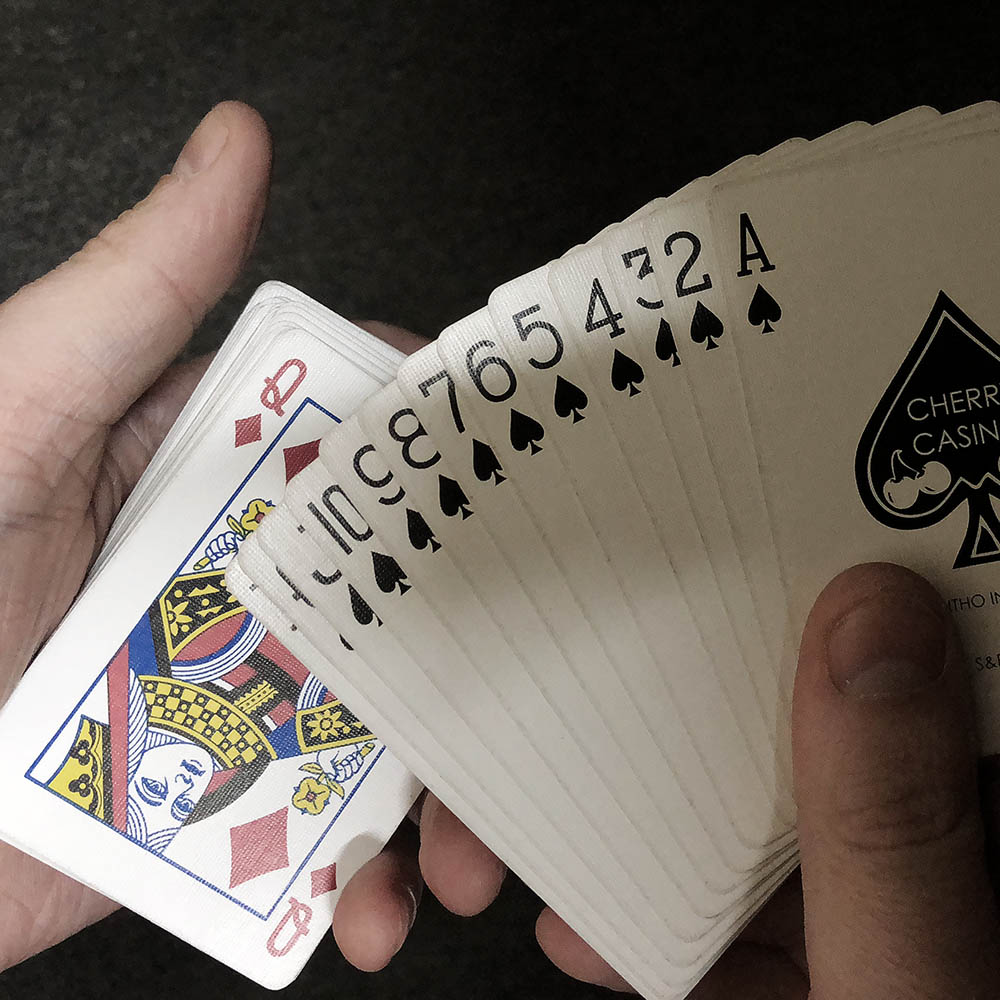
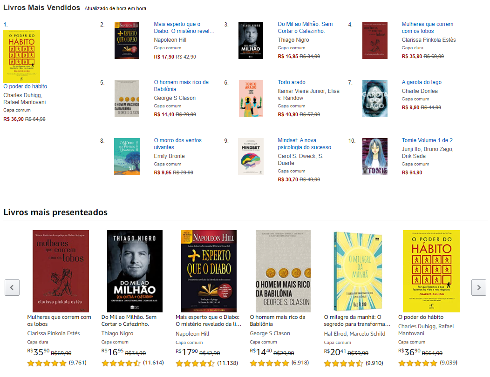
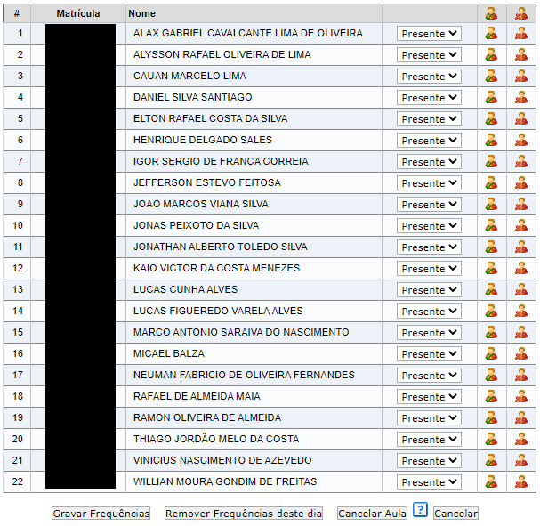

# Algoritmos de Ordenação

Ordenação é uma propriedade muito usada no cotidiano.
Nós ordenamos:
 - cartas de baralho
     - 
 - produtos em sites de e-commerce por *preço*, *avaliação*
     - Amazon, Mercado-Livre, Booking, etc
     - 
 - palavras em um dicionário;
     - 
 - alunos em uma lista de frequência
     - 

**Definição de Ordenação**
> "*Ordenar é organizar os elementos em ordem crescente ou decrescente de alguma propriedade.*"

Se temos a seguinte lista, **6, 1, 3, 2, 12, 4, 9**, podemos ordenar ela usando diferentes propriedades:
 - ordem crescente: *1, 2, 3, 4, 6, 9, 12*
 - ordem decrescente: *12, 9, 6, 4, 3, 2, 1*
 - número de fatores: *1, 3, 2, 4, 9, 6, 12*

 Também podemos ter uma lista de *strings*, onde tipicamente se ordena lexicograficamente. E também podemos ter uma lista de um objeto mais complexo, como o objeto *Livro*, no exemplo da Amazon. Neste caso, como o livro pode ter várias propriedades com valores numéricos (valor, avaliação, número de vendas, ...) e valores textuais (nome do livro, nome do autor, nome da editora, ...), é possível ordenar ele usando alguma dessas propriedades.

Quando uma estrutura de dados está desordenada, para encontrar um elemento específico nessa lista precisamos executar uma busca linear, e o pior caso de uma busca linear seria visitar todos os valores da estrutura, i.e., **O(n)**. 

Agora vamos entender quão ruim é executar uma busca linear, quando temos uma lista muito grande. Considere uma lista, com tamanho n=2⁶⁴, e assuma que cada comparação demora 1ms. No pior caso, a busca linear faria 2⁶⁴ comparações, demorando 2⁶⁴ms, o que custaria alguns anos. Por outro lado, se a lista estiver ordenada, é possível realizar a busca binária. Em aulas anteriores já vimos como funciona a busca binária: ele segue uma abordagem que segue o paradigma de divisão e conquista, e em cada iteração o espaço de busca diminui pela metade. Por esta razão, este algoritmo tem complexidade **O(log₂(n))**, sendo portanto um algoritmo muito mais performático do que a busca linear, que tem custo **O(n)**. Nesse caso, quando n=2⁶⁴, se a lista estiver ordenada e pudermos aplicar a busca binária, no pior caso faríamos **log₂(2⁶⁴)** comparações, ou seja, 64 comparações, o que nos daria **64ms**.

Dada a importância da ordenação para sistemas, há muito tempo algoritmos de ordenação são objetos de estudo e otimizações. Nessa disciplina, iniciaremos com alguns algoritmos mais didáticos e simples de serem implementados, que por sua simplicidade são menos performáticos. São eles: **SelectionSort, BubbleSort, e InsertionSort**. Em seguida, estudaremos algoritmos mais elaborados, que são usados com frequência na maioria das bibliotecas de linguagens de programação. São eles: **Merge-Sort, Quick-Sort e Counting-Sort**.

Algoritmos de ordenação geralmente são classificados quanto a:
 - complexidade de tempo
 - complexidade de espaço (ou uso de memória):
     - in-place (quantidade de memória usada é constante)
     - out-of-place (quantidade de memória usada cresce com o tamanho da entrada)
 - estabilidade
     - imagine a seguinte combinação de cartas: [3♠, 6♥, 2♠, 5♣, 3♦] 
         - um algoritmo estável preserva a ordem relativa de elementos: [2♠, 3♠, 3♦, 5♣, 6♥]
         - um algoritmo instável não preserva a ordem relativa de elementos: [2♠, 3♦, 3♠, 5♣, 6♥]
 - interna ou externa
     - interna: o algoritmo executa completamente usando apenas memória primária
     - externa: o algoritmo executa usando tanto memória primária como memória secundária
 - recursivo (MergeSort e QuickSort) ou iterativo (SelectionSort, InsertionSort)