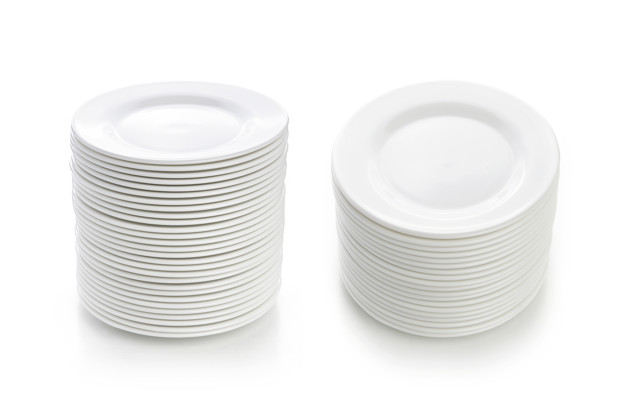

# Pilhas

Assim como somos familiarizados com o termo *lista*, todos nós sabemos o que é uma **pilha**. Nós sabemos o que é uma pilha de louças, uma pilha de documentos, uma pilha de livros, etc. Neste caso, sempre que nos referirmos a uma pilha, denotamos que só conseguimos adicionar novos itens no topo da pilha e remover itens existentes do topo da pilha. 

 Pilha de pratos             |  Pilha de livros
:-------------------------:|:-------------------------:
  |  

**Definição:**
 > Pilhas são listas (ou coleções) de elementos com a restrição de que inserção e remoção só podem ser realizadas de um local, o topo da pilha. Por esta razão, o TAD pilha é considerado do tipo LIFO: last-in-first-out.

 Obviamente, no mundo real, se quisermos, é possível remover um prato ou livro do meio da pilha, bastando para isto apenas puxá-lo. No entanto, para fazer isto em uma pilha, você precisa remover os elementos que estiverem sobre o elemento a ser removido.
 
 Para o nosso estudo, vamos iniciar com uma visão abstrata e superficial da ED pilha. Vamos estudar o **TAD Pilha**. Neste primeiro momento não nos preocuparemos com implementação, mas queremos apenas ter um entendimento superficial de suas operações básicas.

  ## TAD: Pilhas

- Inserir um elemento no topo da pilha: **empilhar(e)** ou **push(e)**.
- Remover um elemento do topo da pilha: **desempilhar()** ou **pop()**.
- Ler o elemento do topo: **topo()**.
- Contar os elementos de uma pilha: **tamanho()**.
- Perguntar se a pilha está vazia: **vazia()**.

Experimente simular graficamente as seguintes operações:
 - empilhar(5)
 - empilhar(9)
 - empilhar(25)
 - topo()
 - desempilhar()
 - desempilhar()
 - vazia()
 - tamanho()
 - topo()
 - desempilhar()

 Onde pilhas são ou poderiam ser aplicadas:
 - chamadas de funções e recursão
 - operações de desfazer em um editor
 - compilhadores: parênteses, colchetes e chaves estão balanceados?

## Implementação: Pilhas usando Arrays

Como pilhas são listas com restrições, é possível perceber que nós podemos reaproveitar o código de ArrayList e modificá-lo para que ele incorpore as restrições de listas. 

## Implementação: Pilhas usando LinkedLists

Como pilhas são listas com restrições, é possível perceber que nós podemos reaproveitar o código de LinkedList e modificá-lo para que ele incorpore as restrições de listas.