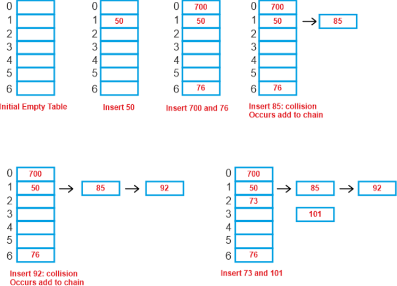
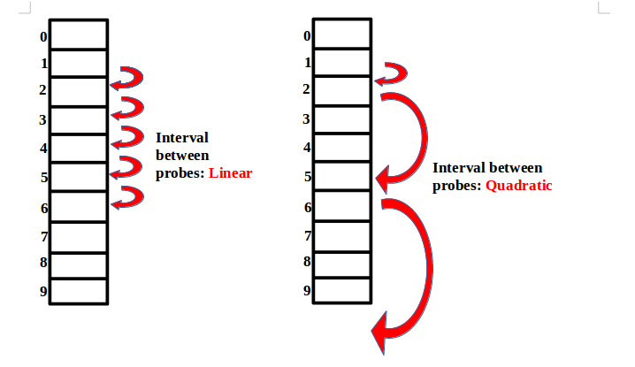

# Tabelas de Dispersão

Tabelas de dispersão têm como base a ideia de que a leitura e o acesso a qualquer posição de um array são extremamente rápidos. 
A razão para isso é bem conhecida. 
Ao ler ou escrever em um vetor em uma posição como 10¹², o sistema operacional determinará o endereço de memória por meio de um cálculo simples, que se baseia na premissa de que todas as posições de um vetor têm o mesmo tamanho em bytes: endereço de memória = endereço base + (10¹² * sizeof(type)). 
Por exemplo, dependendo do tipo de dado do vetor, sizeof(type) pode retornar 4 bytes se o tipo for um inteiro, ou 8 bytes se for um long.

Observe que, até este ponto, não estudamos um Tipo Abstrato de Dados (TAD) ou Estrutura de Dados (ED) que ofereça um desempenho de tempo O(1) para todas as suas operações. 
Até agora, as árvores balanceadas (AVL) demonstraram o melhor desempenho, com complexidade O(log n) para operações de leitura, escrita e remoção. 
Tabelas de dispersão, por outro lado, oferecem um desempenho O(1) (ou muito próximo disso) para operações de leitura, escrita e remoção. 
Portanto, é fundamental familiarizarmo-nos com essa estrutura e compreender o seu funcionamento.

## Estrutura e Funcionamento Básico

As tabelas de dispersão utilizam chaves para realizar o mapeamento de entidades na tabela. 
Para ilustrar este conceito, imagine que estamos realizando um censo do IBGE no qual precisamos mapear todas as pessoas e armazená-las em um banco de dados, além de realizar processamento de dados. 
Para essa finalidade, podemos considerar a seguinte estrutura de dados resumida em Go:
```go
type Pessoa struct {
	cpf   int
	nome string
}
```

No Brasil, um CPF possui 11 dígitos.
Se optarmos por usar o CPF como chave para mapear todos os brasileiros em um vetor, surge um problema: precisaríamos de um vetor muito grande para acomodar todas as pessoas. 
Precisaríamos de um vetor no seguinte com índices dentro desse intervalo: [00000000000,99999999999].
Para representar 11 dígitos, um tipo int (4 bytes) não seria suficiente; seria necessário usar o tipo long (8 bytes). 
Portanto, nosso vetor consumiria aproximadamente 727 GB de memória. 
Além de consumir uma grande quantidade de RAM, há uma alta probabilidade de haver espaços ociosos.

No entanto, o mapeamento seria trivial. 
Como há um espaço no array para cada possível CPF, se quisermos informações sobre uma pessoa com CPF = 23897429874, saberíamos que suas informações estarão na posição v[23897429874]. 
Portanto, as operações de leitura, escrita e remoção ocorreriam em O(1).

Por outro lado, como não é prático alocar 727 GB em um computador, somos forçados a reduzir o tamanho do vetor. 
O Brasil atualmente possui cerca de 214,3 milhões de pessoas. 
Portanto, podemos tentar alocar um vetor com 215 milhões de posições, resultando em 1,6 GB de RAM alocada, ainda uma quantidade considerável, mas factível.

## Função de Mapeamento (Função de Hashing)

Uma função de mapeamento ajuda a determinar a posição correta de um elemento conhecendo a sua chave. 
Quando o vetor tem tamanho suficiente para armazenar todas as chaves, como no primeiro caso do exemplo anterior, a função de hashing é muito simples: o índice do elemento no vetor será o próprio valor da chave, ou seja, **hash(chave) = chave**. 
Por exemplo, uma pessoa com CPF = 23897429874 terá suas informações armazenadas em v[23897429874], pois **hash(23897429874) = 23897429874**.

No entanto, quando o tamanho do vetor não permite que façamos o mapeamento usando diretamente a chave, porque isso resultaria em índices além dos limites do vetor, é necessário criar uma função de mapeamento que lide com esse problema. 
A forma mais simples de evitar que as chaves sejam mapeadas para índices fora dos limites é aplicar uma operação de módulo que considera o tamanho do vetor: **hash(chave) = chave % n**, onde n é o tamanho do vetor. 
Porém, essa abordagem cria a possibilidade de **colisões**.

## Colisões

Uma colisão acontece quando duas chaves de valores diferentes são mapeadas para a mesma posição no vetor: **hash(chave1) = hash(chave2)**.

### Solução de Colisões

As estratégias mais populares para solução de colisões são **encadeamento e endereçamento aberto**.

**1) Encadeamento (Chaining):** Nesse método, cada posição da tabela hash contém uma lista (ou outra estrutura de dados, como uma árvore) que armazena todos os elementos que mapeiam para essa posição. Quando ocorre uma colisão, o novo elemento é simplesmente adicionado à lista correspondente. É uma técnica eficaz para lidar com colisões e permite que múltiplos elementos compartilhem a mesma posição na tabela.


**2) Endereçamento Aberto (Open Addressing):** Ao contrário do encadeamento, o endereçamento aberto armazena todos os elementos diretamente na tabela hash, sem usar estruturas secundárias. Quando ocorre uma colisão, a tabela é explorada sequencialmente (ou usando uma sequência de sondagem) para encontrar a próxima posição vazia onde o elemento pode ser inserido. Existem várias técnicas de sondagem, como **sondagem linear, sondagem quadrática e sondagem dupla**.

*2.1) Linear Probing (Sondagem Linear):* Na sondagem linear, quando ocorre uma colisão ao inserir um elemento em uma posição específica na tabela hash, você simplesmente avança uma posição de cada vez até encontrar a próxima posição vazia. A fórmula básica usada para sondagem linear é: posição = (posição_inicial + incremento) % tamanho_da_tabela. O incremento é normalmente 1, o que significa que você verifica a próxima posição em sequência. Se essa posição estiver ocupada, você verifica a próxima e assim por diante até encontrar uma posição vazia. Linear probing pode levar a agrupamento de elementos, onde várias colisões consecutivas ocorrem em um local da tabela, o que pode afetar negativamente o desempenho.

*2.2) Quadratic Probing (Sondagem Quadrática):* Na sondagem quadrática, quando ocorre uma colisão, você usa uma fórmula quadrática para calcular a próxima posição a ser verificada. A fórmula geral para a sondagem quadrática é: posição = (posição_inicial + C1 \* tentativa + C2 \* tentativa^2) % tamanho_da_tabela. Neste caso, a tentativa começa em 0 e aumenta em 1 a cada tentativa subsequente. A escolha de constantes C1 e C2 é importante para garantir que todas as posições da tabela sejam eventualmente verificadas. A sondagem quadrática tende a distribuir melhor os elementos na tabela do que a sondagem linear, reduzindo o agrupamento de elementos.
> Suponha que estamos usando quadratic probing em uma tabela hash com 10 posições (0 a 9) e ocorre uma colisão na posição inicial 3 (posição_inicial = 3). A primeira tentativa (tentativa = 0) nos levaria a verificar a posição 3, que já está ocupada. Para encontrar a próxima posição, usamos a fórmula com as constantes C1 e C2.
> Suponha que tenhamos definido C1 = 1 e C2 = 1. Agora, calculamos a próxima posição: posição = (3 + 1 \* 0 + 1 \* 0^2) % 10 = (3 + 0 + 0) % 10 = 3 % 10 = 3. A próxima posição a ser verificada é a posição 3 novamente, o que não resolve o problema. Portanto, aumentamos a tentativa (tentativa = 1) e recalculamos a posição: posição = (3 + 1 \* 1 + 1 \* 1^2) % 10 = (3 + 1 + 1) % 10 = 5 % 10 = 5
> As constantes C1 e C2 podem ser ajustadas de acordo com as características da tabela hash e do problema específico que você está resolvendo. Elas afetam a distribuição de elementos na tabela e podem influenciar o desempenho. É importante escolher valores que garantam que todas as posições sejam eventualmente verificadas e que minimizem o agrupamento de elementos. Experimentar diferentes valores de C1 e C2 pode ser necessário para encontrar a melhor configuração para o seu caso.


### Fator de Carga

As tabelas de dispersão possuem uma propriedade conhecida como "fator de carga" (não deve ser confundido com o fator de balanceamento em Árvores AVL). 
O fator de carga é calculado pela divisão da quantidade de elementos inseridos pelo tamanho do vetor.

É importante observar que quanto maior o fator de carga, maior a probabilidade de ocorrência de colisões. 
O aumento do fator de carga ocorre quando reduzimos o tamanho do vetor ou inserimos mais elementos nele. 
Portanto, o fator de carga é uma propriedade que requer monitoramento constante para determinar se é necessário aumentar o tamanho do vetor.

No entanto, é importante notar que o aumento do tamanho do vetor é uma operação demorada, pois requer o remapeamento de todos os elementos. 
Por esse motivo, é essencial minimizar a necessidade de redimensionamento do vetor, ajustando adequadamente o tamanho inicial da tabela e gerenciando o fator de carga de forma eficaz.
