# MergeSort

Os algoritmos SelectionSort, BubbleSort e InsertionSort são O(n²) no caso médio.
Agora vamos estudar um algoritmo que é O(nlog(n)) no pior caso, ou seja, um algoritmo que no pior caso já é bem melhor do que o caso médio dos algoritmos Selection, Bubble e Insertion.

O algoritmo do MergeSort é classificado como um algoritmo de Divisão e Conquista.
A ideia é dividir recursivamente o array pela metade, até que ele seja indivisível.
E por fim, juntar cada pedaço do array de forma ordenada.

Primeiro, vejamos a ilustração simplificada do MergeSort para o array: [9,4,3,6,3,2,5,7,1,8].
Na verdade, aqui vamos focar na operação de **merge** entre dois arrays ordenados.

- Introdução:
    - 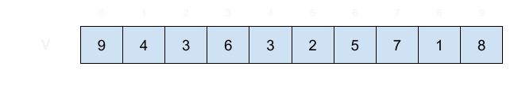
- Passo 1:
    - 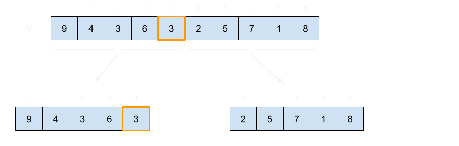
- Passo 2:
    - 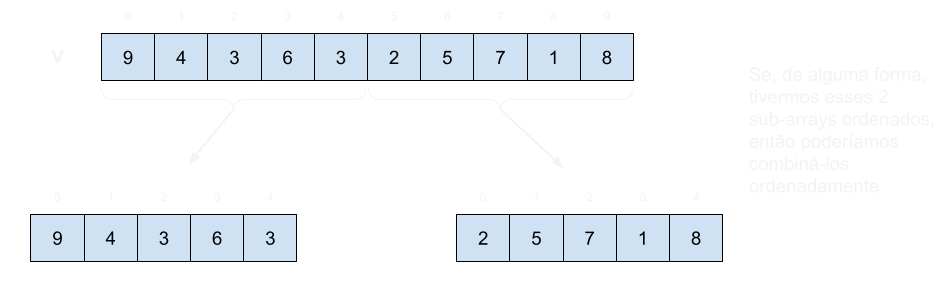
- Passo 3:
    - 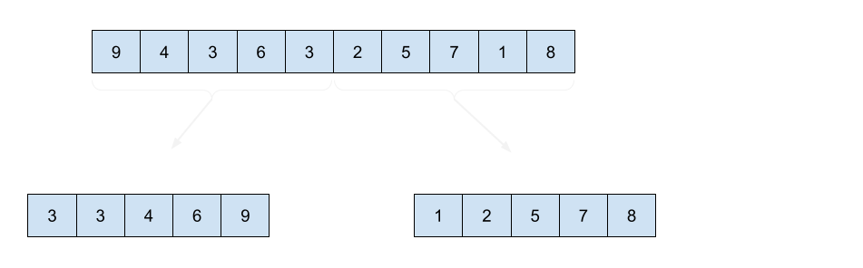
- Passo 4:
    - 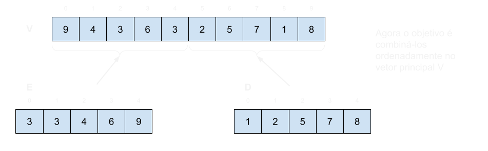
- Passo 5:
    - 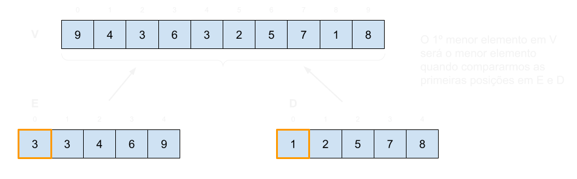
- Passo 6:
    - 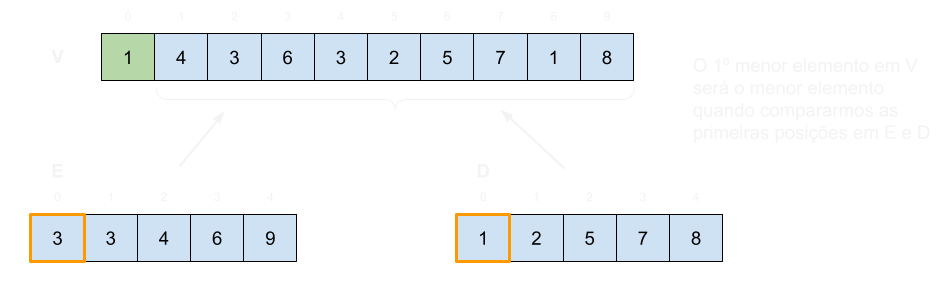
- Passo 7:
    - 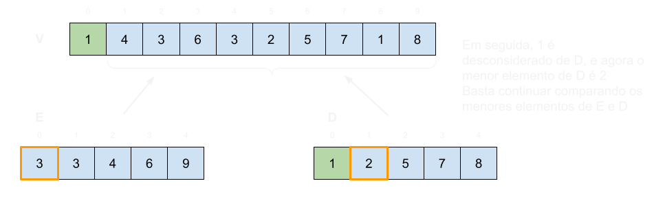
- Passo 8:
    - 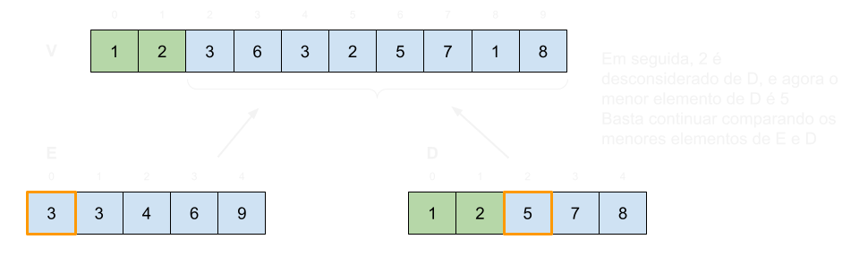
- Passo 9:
    - 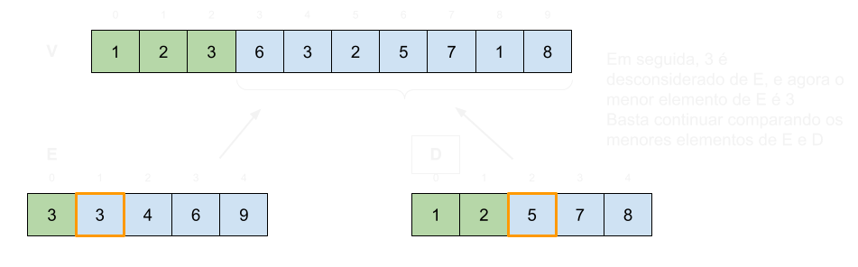
- Passo 10:
    - 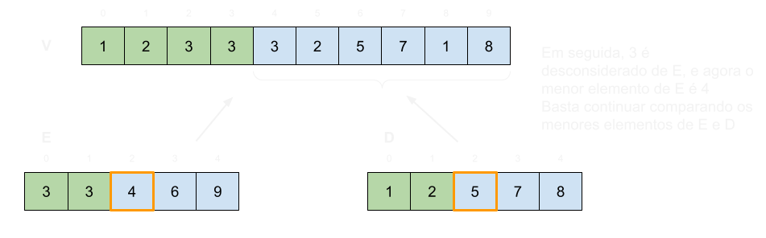
- Passo 11:
    - 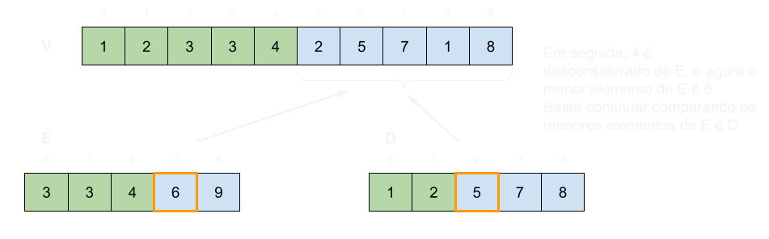
- Passo 12:
    - 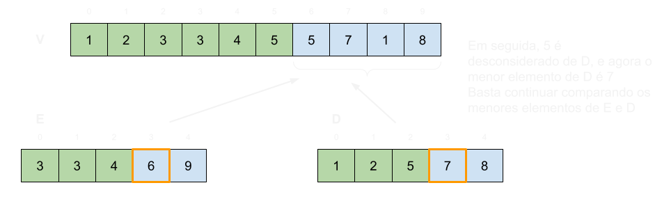
- Passo 13:
    - 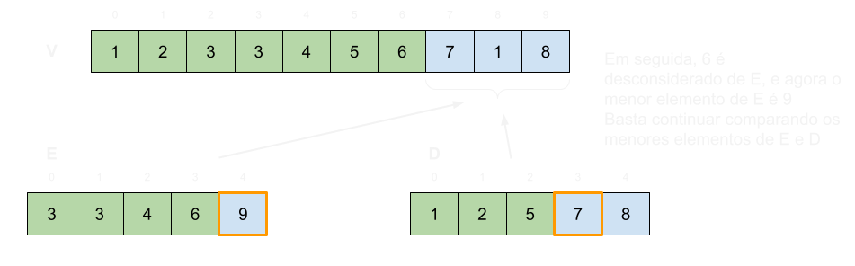
- Passo 14:
    - 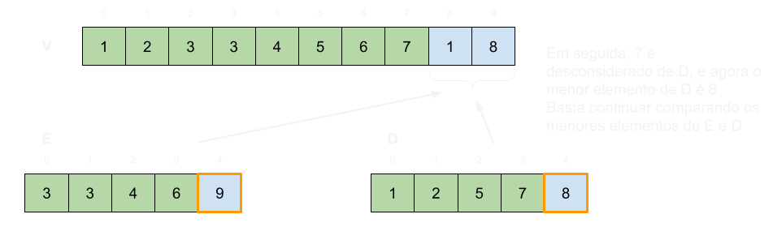
- Passo 15:
    - 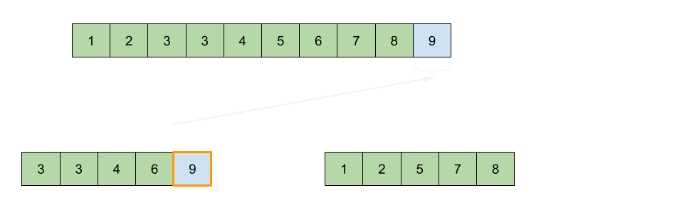
- Passo 16:
    - 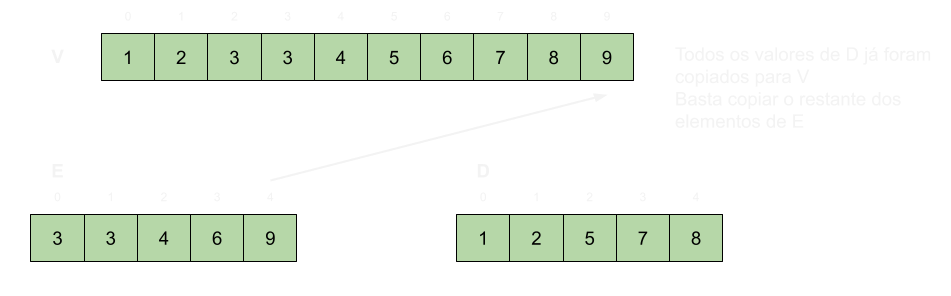

Agora vamos implementar a função de combinação, ou seja, a função **merge**:

```c
void merge(int* v, int tamV, int* e, int tamE, int* d, int tamD){
    int indexV = 0;
    int indexE = 0;
    int indexD = 0;
    while(indexE < tamE && indexD < tamD){
        if(e[indexE] <= d[indexD]){
            v[indexV] = e[indexE];
            indexE++;
        } else{
            v[indexV] = d[indexD];
            indexD++;
        }
        indexV++;
    }
    //ainda poderíamos ter elementos no vetor E que não foram copiados para V
    while(indexE < tamE){
        v[indexV] = e[indexE];
        indexE++;
        indexV++;
    }
    //ainda poderíamos ter elementos no vetor D que não foram copiados para V
    while(indexD < tamD){
        v[indexV] = d[indexD];
        indexD++;
        indexV++;
    }
}
```

Uma vez que tenhamos entendido a operação **merge**, ainda tem um detalhe que precisa ser esclarecido.
Nos passos 2 e 3, supomos que os arrays da direita e esquerda estariam ordenados.
Mas para que eles estejam ordenados, algum algoritmo de ordenação deveria ter sido executado sobre eles, e aí não faria muito sentido o que o algoritmo MergeSort, que é um algoritmo de ordenação, usasse algum outro algoritmo de ordenação.

Uma forma de ter arrays ordenados é dividindo o vetor original em vetores menores até que esses vetores possuam apenas um elemento, sendo portanto considerado ordenado.
Uma vez que um vetor v de tamanho n seja quebrado em n vetores de tamanho 1, podemos utilizar a operação de merge para reconstruirmos os arrays de tamanho intermediário de forma ordenada.

Vejamos a ilustração desta parte (divisão) do algoritmo, a seguir. 

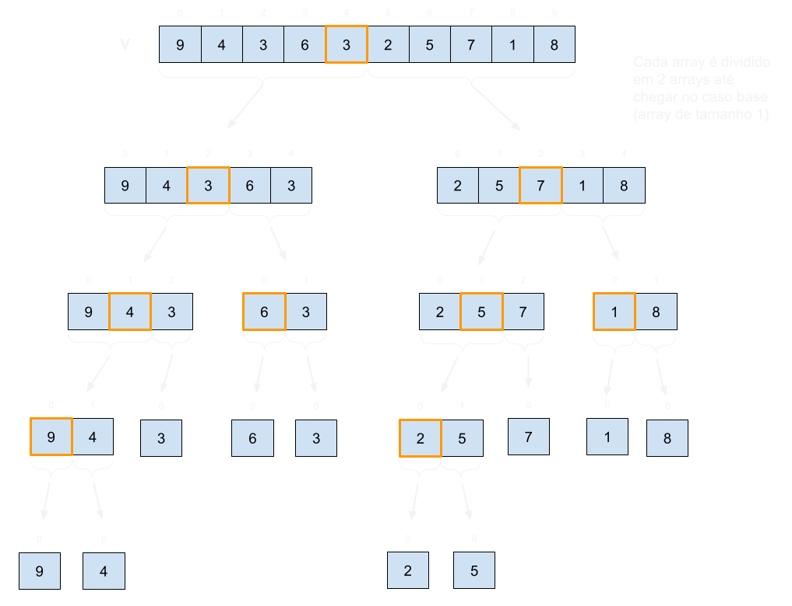

Podemos visualizar o MergeSort passo a passo em https://www.hackerearth.com/practice/algorithms/sorting/merge-sort/visualize/.

Agora vamos implementar a função **MergeSort**, encarregade de dividir o vetor em vetores menores de um elemento, e depois aplicar a função **merge** para combinar esses vetores de forma ordenada.

```c
void mergeSort(int* v, int tamV){
    if(tamV>1){
        //primeiro quebramos o vetor em 2 vetores menores
        int meio = tamV/2;
        
        int tamV1 = meio;
        int* v1 = (int*)malloc(tamV1*sizeof(int));
        for(int i = 0; i < meio; i++){
            v1[i] = v[i];
        }

        int tamV2 = tamV-meio;
        int* v2 = (int*)malloc(tamV2*sizeof(int));
        for(int i = meio; i < tamV; i++){
            v2[i-meio] = v[i];
        }

        mergeSort(v1,tamV1);
        mergeSort(v2,tamV2);
        merge(v,tamV,v1,tamV1,v2,tamV2);
        
        free(v1);
        free(v2);
    }
}
```

Agora podemos simular como a execução do algoritmo acontece do início até o fim, e em qual ordem, usando este vetor como exemplo: [9,4,3,6,3,2,5,7,1,8].

Categorizamos o MergeSort como:

    - um algoritmo de divisão e conquista
    - estável
    - recursivo 
    - out-of-place: O(n), se apagarmos os vetores que não são mais usados (sendo mais específico, θ(n))
    - complexidade de tempo: O(nlogn).
        - a altura da recursão até chegar no caso base log(n)
        - em cada nível executamos o merge em estruturas menores, que somados custam O(n)