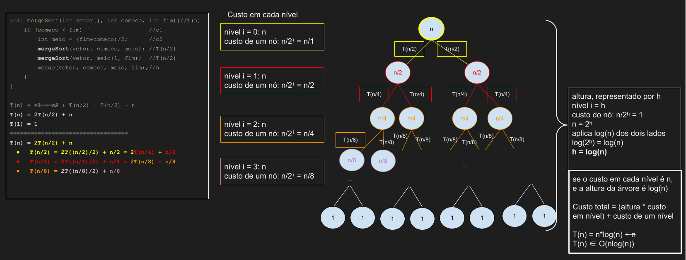

# MergeSort

## Introdução

Os algoritmos SelectionSort, BubbleSort e InsertionSort são O(n²) no caso médio.
Quando nos referimos ao caso médio, significa que a complexidade de tempo leva em consideração o comportamento médio/esperado do algoritmo quando ele executa sobre uma variedade de entradas.
Em contraste com a complexidade de tempo de pior caso, que  descreve o desempenho do algoritmo na condição menos favorável.

Agora vamos estudar um algoritmo que é O(nlog(n)) no pior caso, ou seja, um algoritmo que no pior caso já é bem melhor do que o caso médio dos algoritmos Selection, Bubble e Insertion.

**Observação:** gravei um [vídeo](https://www.youtube.com/watch?v=BZjwEvzH_fQ) e disponibilizei no YouTube sobre o algoritmo MergeSort.

### Estratégia do algoritmo de acordo com seu nome

- Ordenação por mesclagem
- É classificado como um algoritmo de Divisão e Conquista.
  - Divisão: dividimos recursivamente o array pela metade, até que ele seja indivisível
  - Conquista: mesclamos (juntamos/combinamos) os arrays de forma ordenada

## Ilustração do funcionamento do algoritmo

Primeiro, vejamos a ilustração simplificada do MergeSort para o array: [9,4,3,6,3,2,5,7,1,8].
Para simplificar a compreensão do algoritmo como um todo, começaremos a discussão pelo procedimento da conquista, consistindo na mesclagem ordenada dos arrays.
Note, no entanto, que a conquista é executada somente depois da divisão.
Em seguida discutiremos a divisão, a primeira etapa do algoritmo.

### Conquista 

Na verdade, aqui vamos discutir o funcionamento da operação de **merge** entre dois arrays ordenados.
Passos 0, 1, e 2 representam de forma simplificada a divisão e abstrai a forma como os arrays da esquerda e direita foram ordenados. 

- Passo 0:
    - 
- Passo 1:
    - 
- Passo 2:
    - 
- Passo 3:
    - 
- Passo 4:
    - 
- Passo 5:
    - 
- Passo 6:
    - 
- Passo 7:
    - 
- Passo 8:
    - 
- Passo 9:
    - 
- Passo 10:
    - 
- Passo 11:
    - 
- Passo 12:
    - 
- Passo 13:
    - 
- Passo 14:
    - 
- Passo 15:
    - 
- Passo 16:
    - 

### Divisão

Uma vez que tenhamos entendido a operação **merge**, ainda tem um detalhe que precisa ser esclarecido.
Nos passos 2 e 3, supomos que os arrays da direita e esquerda estariam ordenados.
Mas para que eles estejam ordenados, algum algoritmo de ordenação deveria ter sido executado sobre eles, e aí não faria muito sentido o que o algoritmo MergeSort, que é um algoritmo de ordenação, usasse algum outro algoritmo de ordenação.

Uma forma de ter arrays ordenados é dividindo o vetor original em vetores menores até que esses vetores possuam apenas um elemento, sendo portanto considerado ordenado.
Uma vez que um vetor v de tamanho n seja quebrado em n vetores de tamanho 1, podemos utilizar a operação de merge para reconstruirmos os arrays de tamanho intermediário de forma ordenada.

Vejamos a ilustração desta parte (divisão) do algoritmo, a seguir. 


Ao olhar o código que construiremos vocês vão perceber que a divisão é executada recursivamente primeiro em todos os vetores da esquerda, até chegarmos a vetores de tamanho 1.
Posteriormente, a divisão é executada recursivamente em todos os vetores da direita.
Mas perceba que a ilustração, por uma questão de simplicidade, não representa esse aspecto do algoritmo.
Para melhor entender isso, podemos visualizar o MergeSort passo a passo nesse [simulador](https://www.hackerearth.com/practice/algorithms/sorting/merge-sort/visualize/).

## Código

### Conquista 

Agora vamos implementar a função de combinação, ou seja, a função **merge**:

```c
void merge(int* v, int tamV, int* e, int tamE, int* d, int tamD){
    int indexV = 0;
    int indexE = 0;
    int indexD = 0;
    while(indexE < tamE && indexD < tamD){
        if(e[indexE] <= d[indexD]){
            v[indexV] = e[indexE];
            indexE++;
        } else{
            v[indexV] = d[indexD];
            indexD++;
        }
        indexV++;
    }
    //ainda poderíamos ter elementos no vetor E que não foram copiados para V
    while(indexE < tamE){
        v[indexV] = e[indexE];
        indexE++;
        indexV++;
    }
    //ainda poderíamos ter elementos no vetor D que não foram copiados para V
    while(indexD < tamD){
        v[indexV] = d[indexD];
        indexD++;
        indexV++;
    }
}
```

### Divisão 

Agora vamos implementar a função encarregada de dividir o vetor em vetores menores de tamanho 1. 
A função **MergeSort** executa essa divisão recursivamente, e depois aplica recursivamente a função **merge** para combinar esses vetores de forma ordenada.

```c
void mergeSort(int* v, int tamV){
    if(tamV>1){
        //primeiro quebramos o vetor em 2 vetores menores
        int meio = tamV/2;
        
        int tamV1 = meio;
        int* v1 = (int*)malloc(tamV1*sizeof(int));
        for(int i = 0; i < meio; i++){
            v1[i] = v[i];
        }

        int tamV2 = tamV-meio;
        int* v2 = (int*)malloc(tamV2*sizeof(int));
        for(int i = meio; i < tamV; i++){
            v2[i-meio] = v[i];
        }

        mergeSort(v1,tamV1);
        mergeSort(v2,tamV2);
        merge(v,tamV,v1,tamV1,v2,tamV2);
        
        free(v1);
        free(v2);
    }
}
```

## Análise Assintótica

O MergeSort é um algoritmo recursivo. 
Portanto, quando analisamos linha por linha, existirá uma chamada recursiva à própria função mergeSort, e isso torna a análise que discutimos inviável.
Para algoritmos recursivos é preciso estabelecer o que chamamos de relação de recorrência.
Existem diversos métodos para descobrir a complexidade de algoritmos recursivos: iteração, árvore de recursão, substituição e método mestre.
A seguir eu ilustro a análise assintótica do mergeSort através da combinação entre os métodos iterativos e da árvore de recursão.



## Resumo

- Algoritmo de divisão e conquista
- Recursivo
- Out-of-place
- Estável
- O(nlogn), Ômega(nlogn), portanto, Theta(nlogn)
  - a altura da recursão até chegar no caso base é log(n)
  - em cada nível executamos o merge em estruturas menores, que somados custam O(n) 
