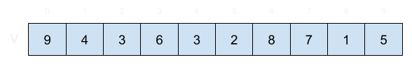
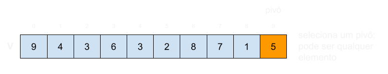
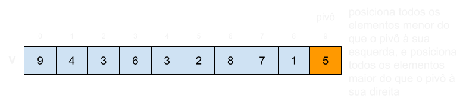
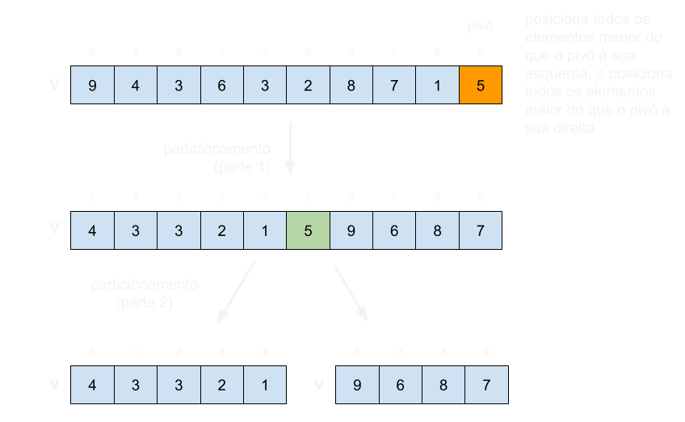
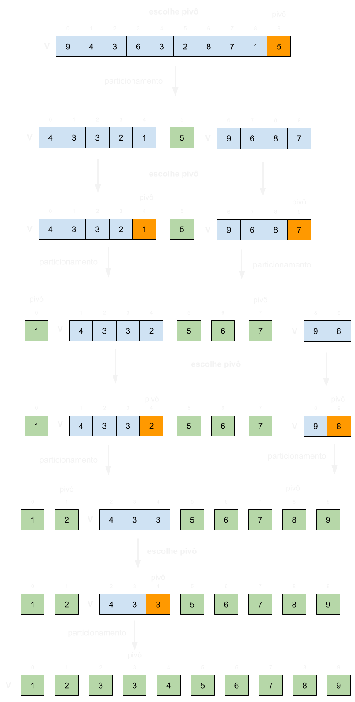
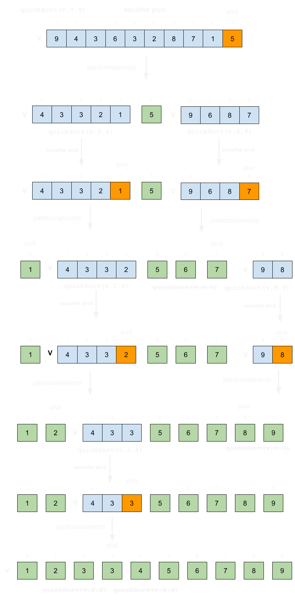
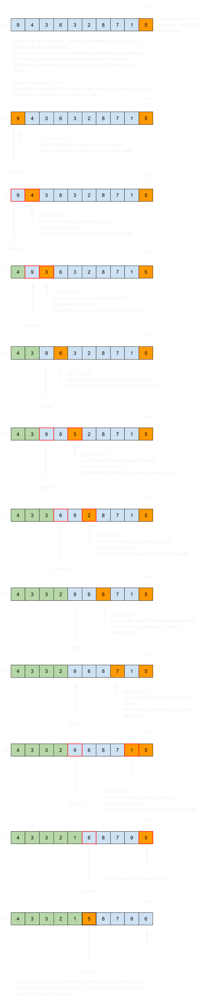

# QuickSort

Até agora estudamos algoritmos com complexidade de tempo O(n²), Insertion, Selection e Bubble, e um algoritmo com complexidade de tempo de pior caso O(nlog(n)), o MergeSort.
Porém, um aspecto negativo do MergeSort é que ele é out-of-place, com complexidade O(n).

Agora vamos estudar o QuickSort.
O QuickSort é **in-place**, ou seja, possui complexidade de espaço O(1).
O QuickSort possui **complexidade de tempo de caso médio O(nlog(n))**.
Masssss, o QuickSort possui **complexidade de tempo de pior caso O(n²)**.
No entanto, essa complexidade de tempo de pior caso é nas maiorias do caso evitada se usarmos uma versão do QuickSort cujo pivô é escolhido aleatoriamente.
Por estas razões, o QuickSort é um dos principais algoritmos usados nas LPs como forma de ordenação padrão.

Primeiro, vejamos a ilustração simplificada do QuickSort para o array: [9,4,3,6,3,2,8,7,1,5]. 

- Introdução:
    - 
- Seleção de pivô:
    - 
- Introdução à operação de **particionamento**:
    - 
- Execução de um **particionamento**:
    - 
- Execução recursiva do **particionamento**, até não ser mais possível particionar (sub-array de tamanho 1):
    - 

Uma das principais diferenças do QuickSort para o MergeSort é que a operação de divisão no QuickSort é feita in-place.
A operação de divisão é chamada de **particionamento**.
Nela você escolhe um pivô, que é qualquer elemento do array, e divide o array em duas partes, a parte esquerda contendo apenas elementos menores do que o pivô, e a parte direita contendo apenas elementos maiores do que o pivô.
No entanto, notem que essa reorganização é feita no mesmo array, não utilizando arrays auxiliares.
Para fazermos isso de forma recursiva, usamos os índices para delimitar os "sub-arrays" apenas virtualmente, sem de fato precisarmos criar outros arrays.
Uma consequência da divisão ser feita in-place é que não precisaremos da etapa de **merge**, visto que tudo é feito em apenas um array.

Com esta visão inicial, já conseguimos escrever a estrutura básica da função recursiva QuickSort.

```c
void quickSort(int* v, int ini, int fim){
    if(fim>ini){                        
        int indexPivo = particiona(v,ini,fim);
        quickSort(v,ini,indexPivo-1);
        quickSort(v,indexPivo+1,fim);   //indexPivo já está no seu local
    }
}
```

Neste momento é interessante detalharmos a ilustração anterior com as chamadas recursivas da função QuickSort.



Após termos uma primeira visão de como funciona o QuickSort, vocês já devem ter percebido que a parte mais complicada dele é de fato implementar o particionamento.
Vamos discutir seu funcionamento com a ilustração a seguir.



Após a explicação, creio já estarmos aptos a implementar a função particiona.

```c
void swap(int* v, int i, int j){
    int temp = v[i];
    v[i] = v[j];
    v[j] = temp;
}

int particiona(int* v, int ini, int fim){
    int pIndex = ini;
    int pivo = v[fim];
    for(int i = ini; i < fim; i++){
        if(v[i] <= pivo){
            swap(v,i,pIndex);
            pIndex++;
        }
    }
    swap(v,pIndex,fim);
    return pIndex;
}
```

Categorizamos o QuickSort como:

    - um algoritmo de divisão e conquista
    - instável
    - recursivo 
    - in-place: O(1)
    - complexidade de tempo: 
        - O(nlogn): melhor caso e caso médio
            - a altura da recursão até chegar no caso base log(n)
            - em cada nível executamos o **particiona** em estruturas menores, que somados custam O(n)
        - O(n²): pior caso (pode ser evitado randomizando a escolha do pivô)        
